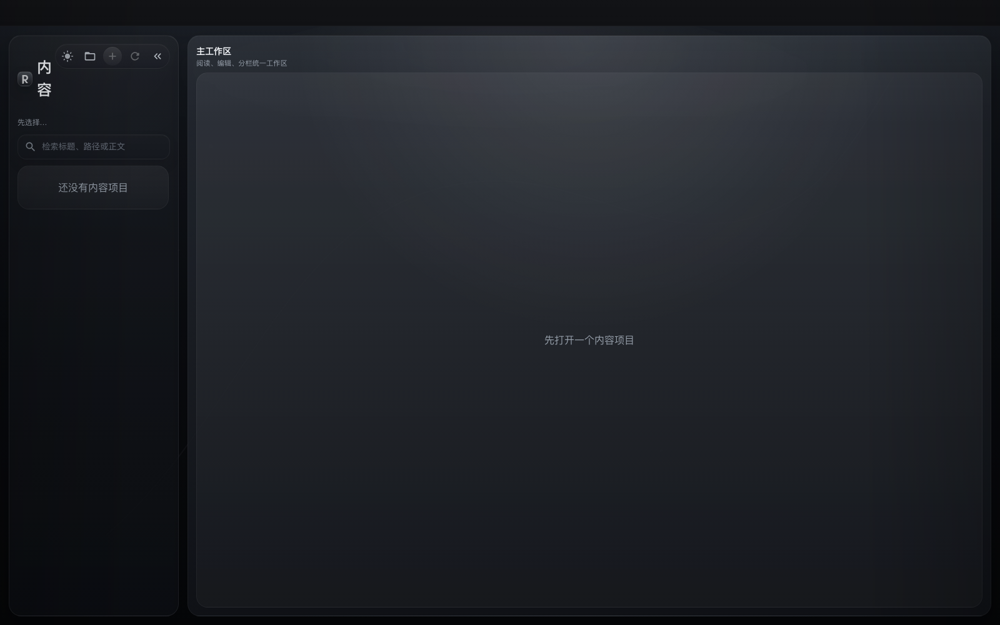

# rReadNote 界面与公开演示说明

rReadNote 将书籍和笔记统一为本地 Markdown 内容项目。公开界面截图只展示安全的空工作区，不读取个人知识库或真实文档。

## 内容工作区

左侧内容栏负责工作区、项目、文档和搜索，右侧主工作区负责阅读、编辑、分栏和阅读进度：

- 选择内容目录后，应用扫描 Markdown 项目并保留项目元数据。
- `book` 和 `note` 使用同一套项目模型，正文仍然是普通 Markdown 文件。
- 阅读进度、当前视图和高亮保存在项目的 `.rreadnote/` 目录。
- 没有选择目录时展示空状态，避免把当前电脑的目录结构写入公开素材。

仓库内置的 `命运的回声` 是合成演示书籍，只用于本地开发和示例；公开截图没有加载任何个人笔记或外部目录。

## 推荐演示流程

1. 使用一个临时测试目录作为内容根目录。
2. 让应用扫描目录，确认项目列表和文档标题来自测试 fixture。
3. 打开文档后尝试阅读、编辑、分栏、搜索、保存进度和添加高亮。
4. 发布截图前删除测试目录中的个人内容，并检查截图中没有用户路径、邮箱或原文资料。

## 公开截图规则

- 只使用仓库内置 Markdown fixture 和合成标题。
- 不把个人 Obsidian、工作笔记、电子书或云盘目录作为截图输入。
- 截图来自本地 web 预览，不代表已扫描用户内容，也不是 Playwright 或冒烟测试结果。

相关入口：[README](../README.md)、[公开仓库边界](../PUBLIC_REPOSITORY.md)、[安全报告](../SECURITY.md)、[发布说明](../RELEASE.md)。
